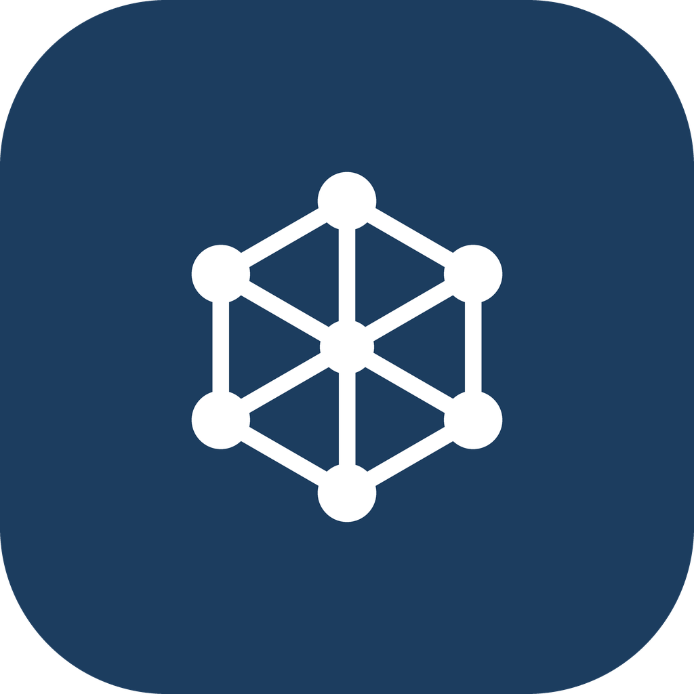
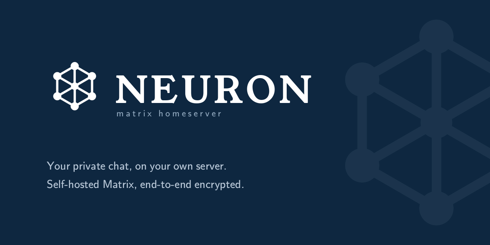

<div align="center">



# NEURON

**matrix homeserver**

_Your private chat, on your own server. Self-hosted Matrix, end-to-end encrypted._



[](https://github.com/Z3iK5/Neuron/actions/workflows/neuron-ci.yml)
&nbsp;[](LICENSE)

</div>

---

**Neuron** is an independent, clean-room Matrix platform — an all-in-one, self-owned
product with its **own** Matrix homeserver, a web admin console, supervision/audit
bots, and a desktop app. It is built strictly from the open Matrix spec/MSCs; it
vendors no homeserver source and is not derived from any other homeserver.

## What's inside

- **`neuron_server`** — a clean-room Matrix homeserver: identity & auth, rooms with
  the spec's authorization rules (room v11), `GET /sync`, a media repository, E2EE
  key relay, the everyday Client-Server API, a **Synapse-compatible Admin API**, and
  **server-to-server federation** — signed events, key resolution, join / leave /
  invite, live messaging, backfill, read receipts, typing, and delivery durability.
- **`neuron_console`** — a branded web admin console for operating the server.
- **Neuron Desktop** — run your own homeserver as an installed app: first-run setup,
  a menu-bar/tray control, and cross-platform bundles.
- **`neuron_supervisor` / `neuron_auditor`** — moderation and audit bots.

## Quick start

```bash
cd neuron
pip install -e ".[server]"
neuron-server          # serves on 127.0.0.1:8008 → open http://localhost:8008
neuron-server doctor   # preflight: config, database, keys, reachability
```

New here? Open `http://localhost:8008` and hit **Get started** to create an account
right in the browser, or share an invite link / QR from the admin console.

Prefer an app? `pipx install "neuron[desktop]" && neuron-desktop` runs a first-run
wizard, then starts the server with all state in a per-user data directory.

## Docs

- **[Full project README](neuron/README.md)** — features, install, honest scope
- [Architecture](ARCHITECTURE.md) · [Homeserver plan](HOMESERVER-PLAN.md) ·
  [Desktop plan](DESKTOP-PLAN.md) · [Feature matrix](FEATURE-MATRIX.md)
- [Brand assets](neuron/assets/brand/) — the NEURON mark, palette, and type

> **Status.** The non-federating homeserver MVP is complete, and federation is
> functional end-to-end (proven by two-server tests). Built clean-room from the open
> spec — see the full README for honest scope and caveats.
